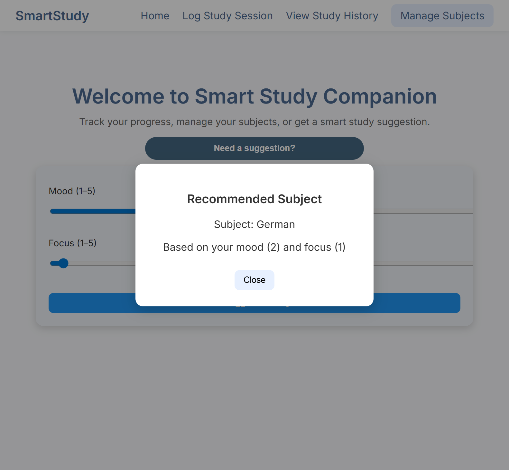
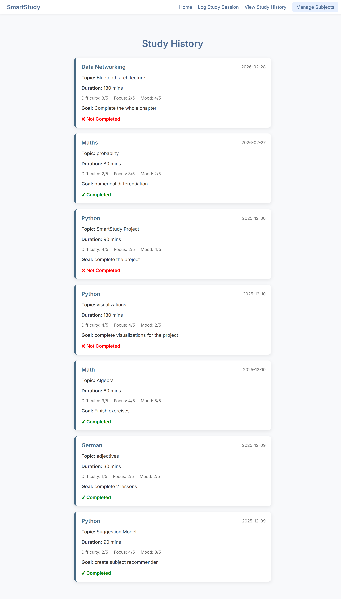
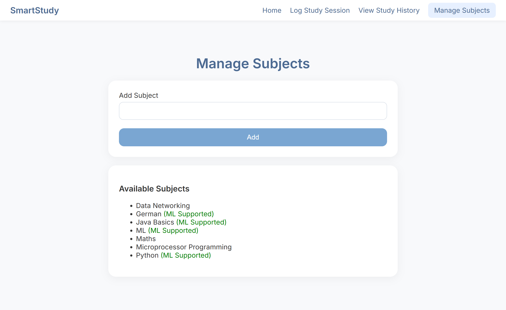

# 📚 Smart Study Companion

A full-stack Flask web application that intelligently recommends what subject to study based on behavioral patterns such as mood, focus level, and time-based features.

The app allows users to log structured study sessions, manage subjects, and receive ML-powered recommendations — all backed by a SQLite database.

---

## 🚀 Features

- 📌 Add and manage custom subjects  
- 📝 Log detailed study sessions (mood, focus, difficulty, goals)  
- 🤖 Machine Learning–based subject recommendation  
- ✅ Validation to prevent unsupported predictions  
- 📊 Persistent session logging with SQLite  
- 📚 View complete study history with clean card-based UI  
- 🎨 Responsive and minimal interface  
- 🔒 Safe and controlled prediction output  

---

## 🧠 Machine Learning Model

The recommendation model was trained using:

- Mood (1–5)
- Focus Level (1–5)
- Perceived Difficulty
- Hour of Day
- Weekday
- Study Duration

The predicted subject is validated against the user’s managed subject list before being displayed, ensuring realistic and safe outputs.

---

## 🏗 Tech Stack

### Backend
- Python
- Flask

### Machine Learning
- scikit-learn
- joblib

### Data Processing
- Pandas

### Database
- SQLite

### Frontend
- HTML
- CSS

---
## 📸 Screenshots

### 🏠 Suggestion Card / Home Page


### 📝 Log Study Session


### 📊 Study History


### 📚 Manage Subjects


---

## 🔮 Future Improvements

- Per-user adaptive model training  
- Enhanced analytics dashboard  
- Data visualization for productivity trends  
- Authentication & multi-user support  
- Deployment-ready production configuration  

---

## 🎯 Learning Outcomes

This project demonstrates:

- Full-stack web development with Flask  
- Machine learning integration into a live web application  
- Feature engineering and prediction pipelines  
- Database schema design and structured logging  
- Modular backend architecture  
- UI refinement and responsive layout design  

---

## ⚙️ Setup Instructions

```bash
# Clone repository
git clone <your-repo-link>

# Navigate into project
cd smart_study_companion

# Install dependencies
pip install -r requirements.txt

# Initialize database
python database.py

# Run application
python app.py


